# AutoVolt IoT Classroom Automation System - Class Diagram

```mermaid
classDiagram
    %% Core System Classes
    class AutoVoltSystem {
        +MongoDB database
        +Express server
        +MQTT broker
        +WebSocket server
        +JWT authentication
        +Role-based access control
        +start()
        +stop()
        +healthCheck()
    }

    %% User Management Classes
    class User {
        +ObjectId _id
        +String name
        +String email
        +String password
        +String role
        +Number roleLevel
        +Object permissions
        +String department
        +Array assignedDevices
        +Boolean isActive
        +Boolean isApproved
        +matchPassword(password): Boolean
        +generateAuthToken(): String
        +hasPermission(permission): Boolean
        +canAccessDevice(deviceId): Boolean
    }

    class UserController {
        +register(userData): Promise<User>
        +login(credentials): Promise<Token>
        +getProfile(userId): Promise<User>
        +updateProfile(userId, data): Promise<User>
        +approveUser(userId, approverId): Promise<User>
        +resetPassword(email): Promise<void>
        +changePassword(userId, passwords): Promise<void>
    }

    class AuthMiddleware {
        +auth(req, res, next): void
        +authorize(roles): Function
        +requirePermission(permission): Function
        +checkDeviceAccess(deviceId): Function
    }

    %% Device Management Classes
    class Device {
        +ObjectId _id
        +String name
        +String macAddress
        +String ipAddress
        +String location
        +String classroom
        +String status
        +Array switches
        +Array assignedUsers
        +Boolean pirEnabled
        +Object motionSensor
        +connect(): Promise<void>
        +disconnect(): Promise<void>
        +updateState(state): Promise<void>
        +toggleSwitch(switchId, state): Promise<void>
        +getTelemetry(): Promise<Object>
        +validateGpioPins(): Boolean
    }

    class Switch {
        +String name
        +Number gpio
        +String type
        +Boolean state
        +String icon
        +Boolean manualOverride
        +Number powerRating
        +Date lastStateChange
        +toggle(state): Promise<void>
        +getPowerConsumption(): Number
        +isManualMode(): Boolean
    }

    class DeviceController {
        +createDevice(deviceData): Promise<Device>
        +getDevices(filters): Promise<Array<Device>>
        +getDevice(deviceId): Promise<Device>
        +updateDevice(deviceId, data): Promise<Device>
        +deleteDevice(deviceId): Promise<void>
        +bulkToggle(devices, state): Promise<Array<Result>>
        +getDeviceStats(deviceId): Promise<Object>
    }

    %% IoT Communication Classes
    class MQTTHandler {
        +Aedes broker
        +connect(): Promise<void>
        +subscribe(topic): Promise<void>
        +publish(topic, message): Promise<void>
        +handleDeviceMessage(topic, message): void
        +handleConfigUpdate(deviceId, config): void
        +handleStateChange(deviceId, state): void
    }

    class WebSocketServer {
        +SocketIO server
        +connect(): Promise<void>
        +emit(event, data): void
        +on(event, handler): void
        +joinRoom(roomId, socketId): void
        +leaveRoom(roomId, socketId): void
        +broadcastToRoom(roomId, event, data): void
    }

    %% Ticket System Classes
    class Ticket {
        +String ticketId
        +String title
        +String description
        +String category
        +String priority
        +String status
        +ObjectId createdBy
        +ObjectId assignedTo
        +ObjectId deviceId
        +Array comments
        +Array attachments
        +String resolution
        +Date resolvedAt
        +Date closedAt
        +addComment(comment): Promise<void>
        +changeStatus(status, userId): Promise<void>
        +assignTo(userId, assignedBy): Promise<void>
        +addAttachment(file): Promise<void>
        +calculateDaysOpen(): Number
    }

    class TicketController {
        +createTicket(ticketData): Promise<Ticket>
        +getTickets(filters): Promise<Array<Ticket>>
        +getTicket(ticketId): Promise<Ticket>
        +updateTicket(ticketId, data): Promise<Ticket>
        +deleteTicket(ticketId): Promise<void>
        +addComment(ticketId, comment): Promise<void>
        +getTicketStats(): Promise<Object>
    }

    %% Analytics Classes
    class AnalyticsService {
        +calculateEnergyConsumption(startDate, endDate): Promise<Object>
        +getDeviceUptime(deviceId, period): Promise<Object>
        +generateUsageReport(filters): Promise<Object>
        +detectAnomalies(deviceId, data): Promise<Array<Anomaly>>
        +forecastConsumption(deviceId, periods): Promise<Array<Forecast>>
        +getDashboardData(): Promise<Object>
    }

    class EnergyTracker {
        +startTracking(deviceId, switchId): Promise<void>
        +stopTracking(deviceId, switchId): Promise<void>
        +calculateConsumption(duration, powerRating): Number
        +recordConsumption(data): Promise<void>
        +getDailyConsumption(deviceId, date): Promise<Object>
        +getMonthlyConsumption(deviceId, month, year): Promise<Object>
    }

    %% AI/ML Classes
    class AIMLService {
        +FastAPI app
        +Prophet model
        +IsolationForest anomalyDetector
        +analyzeUsagePatterns(deviceId, data): Promise<Object>
        +forecastConsumption(deviceId, periods): Promise<Array<Forecast>>
        +detectAnomalies(data): Promise<Array<Anomaly>>
        +generateSmartSchedule(deviceId, patterns): Promise<Schedule>
        +predictDeviceFailure(deviceId, telemetry): Promise<Risk>
    }

    class SmartScheduler {
        +analyzeDeviceUsage(deviceId): Promise<Object>
        +generateScheduleRecommendations(deviceId): Promise<Array<Schedule>>
        +optimizeEnergyUsage(devices): Promise<Array<Optimization>>
        +predictPeakUsage(hours): Promise<Array<Prediction>>
        +calculateConfidenceScore(patterns): Number
    }

    %% Notification Classes
    class NotificationService {
        +createNotification(data): Promise<Notification>
        +sendEmail(notification): Promise<void>
        +sendSMS(notification): Promise<void>
        +sendInApp(notification): Promise<void>
        +sendTelegram(notification): Promise<void>
        +markAsRead(notificationId, userId): Promise<void>
        +getUserNotifications(userId, filters): Promise<Array<Notification>>
    }

    class Notification {
        +ObjectId _id
        +ObjectId recipient
        +String type
        +String title
        +String message
        +String priority
        +Boolean isRead
        +Date readAt
        +Object relatedEntity
        +Array actions
        +markAsRead(): Promise<void>
        +sendEmail(): Promise<void>
        +sendSMS(): Promise<void>
    }

    %% Schedule Management Classes
    class ScheduleManager {
        +createSchedule(scheduleData): Promise<Schedule>
        +updateSchedule(scheduleId, data): Promise<Schedule>
        +deleteSchedule(scheduleId): Promise<void>
        +executeSchedule(scheduleId): Promise<void>
        +getActiveSchedules(): Promise<Array<Schedule>>
        +calculateNextRun(schedule): Date
        +validateSchedule(schedule): Boolean
    }

    class Schedule {
        +ObjectId _id
        +String name
        +Boolean enabled
        +String type
        +String time
        +Array days
        +String action
        +Number duration
        +Array switches
        +Boolean checkHolidays
        +Boolean respectMotion
        +ObjectId createdBy
        +Date lastRun
        +Date nextRun
        +execute(): Promise<void>
        +isDue(): Boolean
        +getNextRunTime(): Date
    }

    %% Security Classes
    class SecurityManager {
        +validateInput(data, schema): Boolean
        +sanitizeData(data): Object
        +checkRateLimit(ip, endpoint): Boolean
        +auditLog(action, userId, details): Promise<void>
        +detectIntrusion(patterns): Promise<Array<Alert>>
        +encryptSensitiveData(data): String
        +decryptSensitiveData(data): String
    }

    class AuditLogger {
        +logActivity(action, userId, details): Promise<void>
        +logSecurityEvent(event, severity): Promise<void>
        +logDeviceEvent(deviceId, event): Promise<void>
        +getActivityLogs(filters): Promise<Array<Log>>
        +getSecurityLogs(filters): Promise<Array<Log>>
        +generateAuditReport(period): Promise<Object>
    }

    %% Relationships
    AutoVoltSystem *-- UserController
    AutoVoltSystem *-- DeviceController
    AutoVoltSystem *-- TicketController
    AutoVoltSystem *-- AnalyticsService
    AutoVoltSystem *-- NotificationService
    AutoVoltSystem *-- ScheduleManager
    AutoVoltSystem *-- MQTTHandler
    AutoVoltSystem *-- WebSocketServer
    AutoVoltSystem *-- AIMLService
    AutoVoltSystem *-- SecurityManager
    AutoVoltSystem *-- AuditLogger

    UserController --> User
    UserController --> AuthMiddleware
    DeviceController --> Device
    Device --> Switch
    TicketController --> Ticket
    AnalyticsService --> EnergyTracker
    AIMLService --> SmartScheduler
    ScheduleManager --> Schedule
    NotificationService --> Notification

    MQTTHandler --> Device
    WebSocketServer --> User
    WebSocketServer --> Device

    AuthMiddleware --> User
    SecurityManager --> User
    SecurityManager --> Device
    AuditLogger --> User
    AuditLogger --> Device
    AuditLogger --> Ticket

    %% Frontend Classes
    class ReactApp {
        +Vite devServer
        +React Router
        +Context providers
        +Component tree
        +render(): JSX.Element
        +handleRoute(path): Component
    }

    class Dashboard {
        +DeviceGrid devices
        +AnalyticsCharts charts
        +NotificationPanel notifications
        +ControlPanel controls
        +render(): JSX.Element
        +handleDeviceToggle(deviceId, switchId): void
        +refreshData(): void
    }

    class DeviceCard {
        +Device device
        +Array switches
        +render(): JSX.Element
        +handleSwitchToggle(switchId): void
        +showDeviceDetails(): void
    }

    AutoVoltSystem --> ReactApp
    ReactApp --> Dashboard
    Dashboard --> DeviceCard

    %% Mobile Classes
    class CapacitorApp {
        +Android/iOS runtime
        +Native plugins
        +WebView container
        +render(): void
        +handleNativeEvent(event): void
    }

    class VoiceControl {
        +Web Speech API
        +Voice commands
        +Speech recognition
        +Text-to-speech
        +processCommand(command): Result
        +speakResponse(text): void
    }

    ReactApp --> CapacitorApp
    CapacitorApp --> VoiceControl

    %% External Services
    class TelegramBot {
        +Telegram API
        +Bot commands
        +Message handling
        +sendMessage(chatId, text): Promise<void>
        +handleCommand(command, args): Promise<void>
        +processDeviceControl(command): Promise<Result>
    }

    class EmailService {
        +SMTP client
        +Template engine
        +sendEmail(to, subject, template, data): Promise<void>
        +sendNotification(notification): Promise<void>
    }

    class MonitoringService {
        +Prometheus metrics
        +Grafana dashboards
        +Health checks
        +collectMetrics(): Object
        +generateReport(): Object
        +alertOnThreshold(metric, threshold): void
    }

    NotificationService --> TelegramBot
    NotificationService --> EmailService
    AutoVoltSystem --> MonitoringService
```

## Class Diagram Explanation

### Core Architecture Classes

**AutoVoltSystem**: Main system orchestrator managing all components
- Manages database connections, server lifecycle, and inter-component communication
- Provides health monitoring and system-wide configuration

### User Management Layer
- **User**: Core user entity with role-based permissions
- **UserController**: Handles user CRUD operations and authentication
- **AuthMiddleware**: JWT-based authentication and authorization

### Device Management Layer
- **Device**: Represents ESP32 IoT devices with switches and sensors
- **Switch**: Individual controllable switches within devices
- **DeviceController**: Device lifecycle and control operations

### Communication Layer
- **MQTTHandler**: Manages device-to-server communication via MQTT protocol
- **WebSocketServer**: Real-time bidirectional communication with clients

### Business Logic Layer
- **Ticket**: Support ticket system for issue tracking
- **AnalyticsService**: Energy consumption and usage analytics
- **ScheduleManager**: Automated device scheduling and control
- **NotificationService**: Multi-channel notification delivery

### AI/ML Layer
- **AIMLService**: Python-based predictive analytics service
- **SmartScheduler**: Intelligent scheduling based on usage patterns

### Security & Audit Layer
- **SecurityManager**: Input validation, rate limiting, encryption
- **AuditLogger**: Comprehensive activity and security logging

### Frontend Layer
- **ReactApp**: Main web application with routing and state management
- **Dashboard**: Main UI component with device controls and analytics
- **CapacitorApp**: Mobile app wrapper for native functionality

### External Integrations
- **TelegramBot**: External messaging interface for device control
- **EmailService**: Notification delivery via email
- **MonitoringService**: System monitoring and alerting

### Key Relationships

1. **Composition**: AutoVoltSystem contains all major controllers and services
2. **Association**: Controllers interact with their respective models
3. **Dependency**: Services depend on external APIs and databases
4. **Inheritance**: Not extensively used, favoring composition
5. **Aggregation**: Collections of objects (devices, switches, notifications)

### Design Patterns Used

- **MVC Pattern**: Controllers handle business logic, models manage data
- **Observer Pattern**: WebSocket server notifies clients of changes
- **Factory Pattern**: Device creation with different configurations
- **Strategy Pattern**: Different notification delivery methods
- **Middleware Pattern**: Express middleware for authentication/authorization
- **Repository Pattern**: Data access abstraction (implied in controllers)

This class diagram provides a comprehensive view of the AutoVolt system's object-oriented architecture, showing how components interact and maintain separation of concerns while supporting the complex IoT automation requirements.