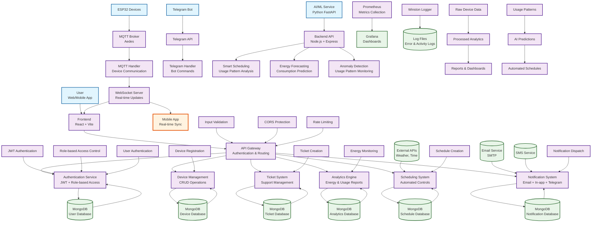

# AutoVolt IoT Classroom Automation System - Data Flow Diagram (DFD)

## Data Flow Diagram Explanation

### Level 0 DFD - Context Diagram

**External Entities:**
- **Users**: Access system via web/mobile apps
- **ESP32 Devices**: IoT hardware sending sensor data via MQTT
- **AI/ML Service**: Python service for predictive analytics
- **Telegram Bot**: External messaging interface

**Main Process:**
- **AutoVolt System**: Central processing hub managing all IoT operations

**Data Stores:**
- **MongoDB**: Primary database for all system data
- **External Services**: Email, SMS, weather APIs

### Level 1 DFD - System Decomposition

**Key Processes:**

1. **Authentication Service**
   - JWT token generation/validation
   - Role-based access control
   - User session management

2. **Device Management**
   - Device registration/configuration
   - Real-time state monitoring
   - GPIO pin management

3. **Ticket System**
   - Support ticket creation/assignment
   - Status tracking and notifications
   - Comment and attachment management

4. **Analytics Engine**
   - Energy consumption tracking
   - Usage pattern analysis
   - Performance reporting

5. **Scheduling System**
   - Automated device control
   - Time-based operations
   - Holiday/schedule management

6. **Notification System**
   - Multi-channel notifications (email/in-app/Telegram)
   - Alert management
   - User preference handling

### Data Flows:

**Primary Data Flows:**
- User requests → Authentication → Authorization → Resource access
- Device telemetry → MQTT → Processing → Database storage
- Analytics data → AI/ML service → Predictions → Automated actions
- System events → Notification service → User alerts

**Real-time Data Flows:**
- WebSocket connections for live updates
- MQTT for device communication
- Push notifications for alerts

**Security Data Flows:**
- JWT tokens for API authentication
- Role-based permissions for access control
- Audit logs for compliance tracking

### Trust Boundaries:

- **External Interfaces**: Web/mobile apps, MQTT broker, Telegram API
- **Internal Processing**: Backend services, database operations
- **Security Controls**: Authentication, authorization, input validation

### Data Stores:

1. **User Database**: User profiles, permissions, authentication data
2. **Device Database**: Device configurations, sensor data, state logs
3. **Ticket Database**: Support tickets, comments, attachments
4. **Analytics Database**: Energy consumption, usage patterns, reports
5. **Schedule Database**: Automated schedules, execution logs
6. **Notification Database**: Alert history, delivery status

This DFD shows how data moves through the AutoVolt system from external sources through processing components to storage and back to users, highlighting the real-time IoT nature of the system and its comprehensive automation capabilities.