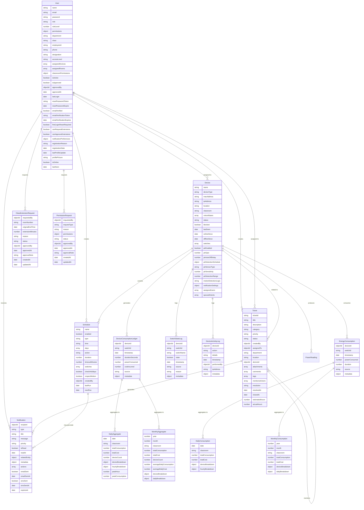

# AutoVolt IoT Classroom Automation System - Entity Relationship Diagram (ERD)



## Entity Relationship Diagram Explanation

### Core Entities & Relationships

#### User Entity (Central Entity)
- **Primary Key**: `_id` (ObjectId)
- **Relationships**:
  - `||--o{ Device`: One-to-many (assigned to) - Users can be assigned to multiple devices
  - `||--o{ Ticket`: One-to-many (creates) - Users create multiple support tickets
  - `||--o{ Ticket`: One-to-many (assigned to) - Users can be assigned multiple tickets
  - `||--o{ Notification`: One-to-many (receives) - Users receive multiple notifications
  - `||--o{ Schedule`: One-to-many (creates) - Users create multiple schedules
  - `||--o{ ClassExtensionRequest`: One-to-many (requests) - Users request class extensions
  - `||--o{ PermissionRequest`: One-to-many (requests) - Users request permissions

#### Device Entity (IoT Hardware)
- **Primary Key**: `_id` (ObjectId)
- **Unique Constraints**: `macAddress`, `ipAddress`
- **Relationships**:
  - `||--o{ Ticket`: One-to-many (related to) - Devices can have multiple related tickets
  - `||--o{ Schedule`: One-to-many (controls) - Schedules control multiple devices
  - `||--o{ DeviceConsumptionLedger`: One-to-many (generates) - Devices generate consumption records
  - `||--o{ SwitchStateLog`: One-to-many (logs) - Devices generate state change logs
  - `||--o{ DeviceActivityLog`: One-to-many (logs) - Devices generate activity logs
  - `||--o{ EnergyConsumption`: One-to-many (consumes) - Devices consume energy
  - `||--o{ PowerReading`: One-to-many (produces) - Devices produce power readings

#### Ticket Entity (Support System)
- **Primary Key**: `_id` (ObjectId)
- **Unique Constraints**: `ticketId`
- **Relationships**:
  - `||--o{ Notification`: One-to-many (generates) - Tickets generate notifications
  - `||--o{ Ticket`: One-to-many (mentions) - Tickets can mention other users

#### Schedule Entity (Automation)
- **Primary Key**: `_id` (ObjectId)
- **Relationships**:
  - `||--o{ Notification`: One-to-many (may generate) - Schedules may generate notifications

### Data Aggregation Hierarchy

#### Energy Consumption Tracking
```
DeviceConsumptionLedger → DailyAggregate → MonthlyAggregate
EnergyConsumption → DailyConsumption → MonthlyConsumption
```

**DeviceConsumptionLedger**: Raw consumption data with precise timestamps
- Tracks individual switch usage duration and power consumption
- Calculates real-time costs based on electricity rates
- Stores metadata for audit trails

**DailyAggregate**: Daily summaries by classroom
- Aggregates consumption data for entire days
- Tracks peak usage hours and consumption
- Provides device-level breakdowns

**MonthlyAggregate**: Monthly summaries and analytics
- Long-term consumption trends
- Average daily usage calculations
- Cost analysis and forecasting data

### Logging & Audit Entities

#### SwitchStateLog
- Tracks every switch state change (ON/OFF)
- Records source of change (manual, automated, voice, etc.)
- Enables usage pattern analysis and troubleshooting

#### DeviceActivityLog
- Comprehensive device activity audit trail
- Tracks user actions, system events, and errors
- IP address logging for security monitoring

### Request Management Entities

#### ClassExtensionRequest
- Handles classroom usage extension requests
- Faculty can request additional class time
- Approval workflow with admin oversight

#### PermissionRequest
- Manages user permission elevation requests
- Role-based approval processes
- Audit trail for security compliance

### Key Design Patterns

#### Role-Based Access Control (RBAC)
- **User Roles**: super-admin, dean, hod, admin, faculty, teacher, student, security, guest
- **Permission Levels**: Hierarchical access control with granular permissions
- **Department-based Access**: Classroom and device access based on department affiliation

#### Multi-tenant Architecture
- **Classroom Isolation**: Data segmented by classroom/location
- **Department Boundaries**: Access controls based on departmental affiliation
- **Device Assignment**: Users assigned to specific devices and classrooms

#### Audit & Compliance
- **Comprehensive Logging**: All user actions and system events logged
- **Data Retention**: Configurable retention policies for different data types
- **Security Monitoring**: Real-time anomaly detection and alerting

#### Real-time IoT Integration
- **MQTT Communication**: Device-to-server messaging with Aedes broker
- **WebSocket Updates**: Real-time UI updates for live dashboards
- **State Synchronization**: Bidirectional state management between devices and database

### Database Optimization Features

#### Indexing Strategy
- **Compound Indexes**: Optimized for common query patterns
- **Unique Constraints**: Data integrity for MAC addresses, IP addresses, ticket IDs
- **TTL Indexes**: Automatic cleanup of expired notifications and logs

#### Data Relationships
- **Referential Integrity**: Foreign key relationships maintained through ObjectId references
- **Embedded Documents**: Complex data structures stored as nested objects
- **Array Fields**: Flexible many-to-many relationships using arrays

#### Performance Considerations
- **Query Optimization**: Indexes designed for dashboard queries and analytics
- **Aggregation Pipelines**: Efficient data processing for reports and analytics
- **Caching Strategy**: Redis integration for frequently accessed data

This ERD provides a comprehensive view of the AutoVolt system's data architecture, supporting complex IoT operations, user management, energy analytics, and automated classroom control while maintaining data integrity and performance optimization.
```</content>
<parameter name="filePath">c:\Users\IOT\Desktop\new-autovolt\ER_DIAGRAM.md