# AutoVolt IoT Classroom Automation System - System Architecture Diagram

```mermaid
graph TB
    %% User Layer
    subgraph "User Interface Layer"
        A1[Web Dashboard<br/>React + TypeScript]
        A2[Mobile App<br/>Capacitor + React]
        A3[Telegram Bot<br/>Node.js + Telegram API]
        A4[Voice Control<br/>Web Speech API]
    end

    %% API Gateway Layer
    subgraph "API Gateway & Authentication"
        B1[Express Server<br/>Port 3001]
        B2[JWT Authentication<br/>Role-based Access]
        B3[CORS Protection<br/>Security Headers]
        B4[Rate Limiting<br/>DDoS Protection]
        B5[Input Validation<br/>express-validator]
    end

    %% Business Logic Layer
    subgraph "Business Logic Layer"
        C1[User Management<br/>CRUD + Permissions]
        C2[Device Management<br/>ESP32 Control]
        C3[Ticket System<br/>Support Management]
        C4[Analytics Engine<br/>Energy Tracking]
        C5[Scheduling System<br/>Automation]
        C6[Notification Service<br/>Multi-channel]
    end

    %% Communication Layer
    subgraph "Real-time Communication"
        D1[WebSocket Server<br/>Socket.IO]
        D2[MQTT Broker<br/>Aedes]
        D3[Device Telemetry<br/>Sensor Data]
        D4[Real-time Updates<br/>Live Dashboard]
    end

    %% AI/ML Layer
    subgraph "AI/ML Services"
        E1[FastAPI Server<br/>Port 8002]
        E2[Smart Scheduling<br/>Prophet Models]
        E3[Energy Forecasting<br/>Time Series]
        E4[Anomaly Detection<br/>Isolation Forest]
        E5[Usage Pattern Analysis<br/>Machine Learning]
    end

    %% Data Layer
    subgraph "Data Storage Layer"
        F1[(MongoDB<br/>Primary Database)]
        F2[(Redis<br/>Cache Layer)]
        F3[(File Storage<br/>Attachments)]
        F4[(Log Files<br/>Winston Logger)]
    end

    %% Infrastructure Layer
    subgraph "Infrastructure & Monitoring"
        G1[Docker Containers<br/>Microservices]
        G2[Prometheus<br/>Metrics Collection]
        G3[Grafana<br/>Visualization]
        G4[Health Checks<br/>System Monitoring]
        G5[Load Balancing<br/>Nginx Proxy]
    end

    %% External Services
    subgraph "External Services"
        H1[Email Service<br/>SMTP]
        H2[SMS Service<br/>Twilio]
        H3[Weather API<br/>External Data]
        H4[Time Service<br/>NTP]
    end

    %% IoT Hardware Layer
    subgraph "IoT Hardware Layer"
        I1[ESP32 Devices<br/>WiFi + MQTT]
        I2[Motion Sensors<br/>PIR + Microwave]
        I3[Manual Switches<br/>GPIO Controls]
        I4[Power Relays<br/>Device Control]
        I5[LED Indicators<br/>Status Display]
    end

    %% Data Flow Connections
    A1 --> B1
    A2 --> B1
    A3 --> B1
    A4 --> B1

    B1 --> B2
    B1 --> B3
    B1 --> B4
    B1 --> B5

    B2 --> C1
    B2 --> C2
    B2 --> C3
    B2 --> C4
    B2 --> C5
    B2 --> C6

    C2 --> D1
    C2 --> D2
    C4 --> E1
    C5 --> E1
    C6 --> H1
    C6 --> H2

    D2 --> I1
    I1 --> D2
    I1 --> D3

    D1 --> A1
    D1 --> A2
    D4 --> A1
    D4 --> A2

    E1 --> E2
    E1 --> E3
    E1 --> E4
    E1 --> E5

    C1 --> F1
    C2 --> F1
    C3 --> F1
    C4 --> F1
    C5 --> F1
    C6 --> F1
    D3 --> F1
    E2 --> F1
    E3 --> F1
    E4 --> F1
    E5 --> F1

    F1 --> F2
    C4 --> F4
    C6 --> F4

    G1 --> B1
    G1 --> E1
    G1 --> F1
    G1 --> G2
    G2 --> G3
    G4 --> G2
    G5 --> B1

    H3 --> C5
    H4 --> C5

    I1 --> I2
    I1 --> I3
    I1 --> I4
    I1 --> I5

    %% Styling
    classDef userInterface fill:#e3f2fd,stroke:#1976d2,stroke-width:2px
    classDef apiGateway fill:#f3e5f5,stroke:#7b1fa2,stroke-width:2px
    classDef businessLogic fill:#e8f5e8,stroke:#388e3c,stroke-width:2px
    classDef communication fill:#fff3e0,stroke:#f57c00,stroke-width:2px
    classDef ai fill:#fce4ec,stroke:#c2185b,stroke-width:2px
    classDef data fill:#e0f2f1,stroke:#00695c,stroke-width:2px
    classDef infrastructure fill:#f9fbe7,stroke:#689f38,stroke-width:2px
    classDef external fill:#efebe9,stroke:#5d4037,stroke-width:2px
    classDef hardware fill:#ffebee,stroke:#d32f2f,stroke-width:2px

    class A1,A2,A3,A4 userInterface
    class B1,B2,B3,B4,B5 apiGateway
    class C1,C2,C3,C4,C5,C6 businessLogic
    class D1,D2,D3,D4 communication
    class E1,E2,E3,E4,E5 ai
    class F1,F2,F3,F4 data
    class G1,G2,G3,G4,G5 infrastructure
    class H1,H2,H3,H4 external
    class I1,I2,I3,I4,I5 hardware
```

## System Architecture Overview

### 1. User Interface Layer
**Web Dashboard**: React + TypeScript application served via Vite
- Device control panels
- Analytics dashboards
- Ticket management
- User administration

**Mobile App**: Capacitor-wrapped React app for Android/iOS
- Native device controls
- Voice commands
- Push notifications
- Offline capabilities

**Telegram Bot**: External messaging interface
- Device control via chat
- Status notifications
- Emergency alerts

**Voice Control**: Browser-based speech recognition
- Natural language commands
- Device control via voice
- Status feedback

### 2. API Gateway & Authentication Layer
**Express Server**: Main API server (Port 3001)
- RESTful API endpoints
- GraphQL support for complex queries
- File upload handling

**Security Components**:
- JWT token authentication
- Role-based access control (RBAC)
- CORS protection
- Rate limiting and DDoS protection
- Input validation and sanitization

### 3. Business Logic Layer
**Core Services**:
- **User Management**: Registration, authentication, permissions
- **Device Management**: ESP32 configuration, control, monitoring
- **Ticket System**: Support ticket lifecycle management
- **Analytics Engine**: Energy consumption tracking and reporting
- **Scheduling System**: Automated device control and calendar integration
- **Notification Service**: Multi-channel alert delivery

### 4. Real-time Communication Layer
**WebSocket Server**: Socket.IO for bidirectional communication
- Live device status updates
- Real-time dashboard updates
- Push notifications

**MQTT Broker**: Aedes MQTT broker for IoT communication
- Device-to-server messaging
- Command delivery to ESP32 devices
- Telemetry data collection

### 5. AI/ML Services Layer
**FastAPI Server**: Python microservice (Port 8002)
- Smart scheduling algorithms
- Energy consumption forecasting
- Anomaly detection in usage patterns
- Predictive maintenance alerts

**ML Models**:
- Prophet for time series forecasting
- Isolation Forest for anomaly detection
- Custom algorithms for usage pattern analysis

### 6. Data Storage Layer
**MongoDB**: Primary NoSQL database
- User profiles and authentication
- Device configurations and telemetry
- Ticket system data
- Analytics and reporting data

**Redis**: Caching layer
- Session storage
- API response caching
- Real-time data buffering

**File Storage**: Local/cloud storage for attachments
- Ticket attachments
- User profile pictures
- System backups

### 7. Infrastructure & Monitoring Layer
**Containerization**: Docker for microservices
- Isolated service deployment
- Easy scaling and updates
- Development environment consistency

**Monitoring Stack**:
- Prometheus for metrics collection
- Grafana for visualization dashboards
- Health checks and alerting
- Performance monitoring

**Load Balancing**: Nginx reverse proxy
- API request distribution
- SSL termination
- Static file serving

### 8. IoT Hardware Layer
**ESP32 Devices**: WiFi-enabled microcontrollers
- GPIO pin control for relays and sensors
- MQTT client for server communication
- Over-the-air (OTA) firmware updates

**Sensors & Actuators**:
- PIR motion sensors
- Microwave radar sensors
- Manual control switches
- Power relays for device control
- LED status indicators

## Key Architectural Principles

### Scalability
- Microservices architecture allows independent scaling
- Horizontal scaling via load balancers
- Database sharding for large datasets

### Security
- Defense in depth with multiple security layers
- JWT tokens with short expiration
- Role-based access control
- Input validation and sanitization
- Audit logging for compliance

### Reliability
- Health checks and automatic failover
- Circuit breakers for external service calls
- Comprehensive error handling and logging
- Data backup and recovery procedures

### Performance
- Caching layers for frequently accessed data
- Asynchronous processing for heavy operations
- Optimized database queries with proper indexing
- Real-time communication for responsive UI

### Maintainability
- Modular architecture with clear separation of concerns
- Comprehensive API documentation
- Automated testing and CI/CD pipelines
- Containerization for consistent deployments

This architecture supports the complex requirements of an IoT classroom automation system, providing reliable device control, intelligent automation, comprehensive analytics, and a user-friendly interface across multiple platforms.